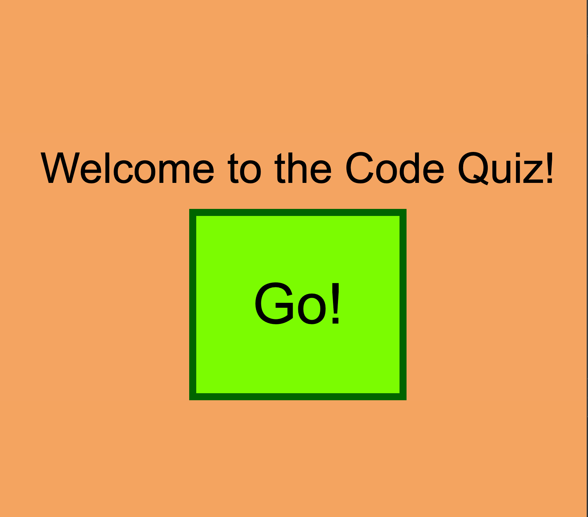

# code_quiz
This is a coding quiz about basic JavaScript for bootcamp students.  There are a total of five questions and a timer of 60 seconds to complete the quiz.  With a wrong attempt at a question, 10 seconds are deducted from the timer.  In order to score higher than 0, all five questions must be answered correctly.  After each attempt at the game, the user is prompted to enter their initials to be saved with their score.  After a succesful attempt at the quiz, the score will be saved as the amount of seconds remaining out of 60.  Users attempt to achieve the highest score possible.

Published Website: https://grantgarrison7.github.io/code_quiz/.

